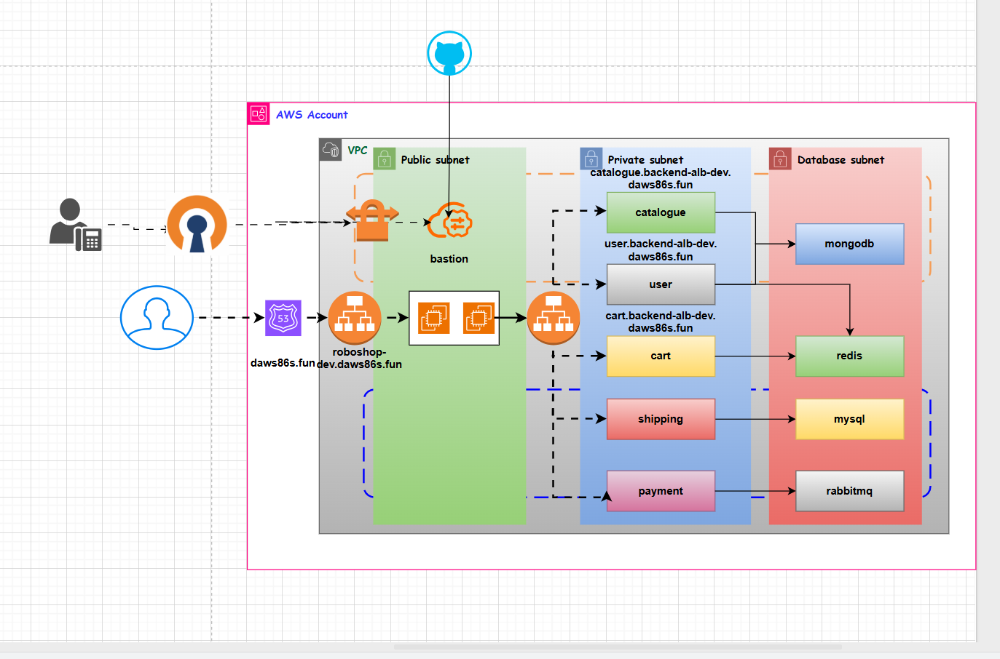

# 🚀 Infrastructure Automation with Terraform & Ansible

## 📌 Overview

This repository demonstrates **Infrastructure as Code (IaC)** using **Terraform** to provision and manage cloud infrastructure in a scalable, repeatable, and automated way, along with **Ansible** for configuration management.

This project reflects real-world DevOps practices including:

* Infrastructure as Code (IaC)
* Modular Terraform design
* Remote backend configuration
* State management and locking
* Secure authentication practices
* Configuration management using Ansible
* Production-ready project structure

---

## 🛠 Tech Stack

* Terraform
* AWS Services: VPC, EC2, S3, IAM, ALB, SSM, CloudFront, VPN, ACM
* Ansible
* Git & GitHub

---

## 📂 Project Structure

```
Terraform/
│
├── main.tf              # Defines core infrastructure resources
├── provider.tf          # Provider configuration (AWS)
├── variables.tf         # Input variables
├── outputs.tf           # Output values
├── parameters.tf        # Stores values in AWS SSM Parameter Store
├── terraform.tfvars     # Variable values (excluded in production)
├── .gitignore           # Ignored files
└── README.md            # Project documentation
```

---

## ⚙️ Prerequisites

Ensure the following tools are installed and configured:

* Terraform (`terraform -v`)
* AWS CLI (`aws configure`)
* IAM user with required permissions
* Git
* Ansible

---

## 🔐 Authentication Setup

Terraform authenticates using:

### Option 1: AWS CLI

```
aws configure
```

### Option 2: Environment Variables

```
export AWS_ACCESS_KEY_ID="your_access_key"
export AWS_SECRET_ACCESS_KEY="your_secret_key"
```

⚠️ **Important:** Never commit secrets to GitHub.

---

## 🚀 How to Use This Project

### 1️⃣ Initialize Terraform

```
terraform init
```

Downloads providers and initializes backend.

---

### 2️⃣ Validate Configuration

```
terraform validate
```

Checks for syntax and configuration issues.

---

### 3️⃣ Format Code

```
terraform fmt
```

Ensures consistent formatting.

---

### 4️⃣ Plan Infrastructure

```
terraform plan
```

Shows execution plan before applying changes.

---

### 5️⃣ Apply Infrastructure

```
terraform apply
```

Auto-approve:

```
terraform apply -auto-approve
```

---

### 6️⃣ Destroy Infrastructure

```
terraform destroy
```

---

## ⚙️ Configuration Management (Ansible)

After provisioning infrastructure using Terraform, **Ansible** is used for:

* Application deployment
* Package installation
* Server configuration
* Service management

### Example:

```
ansible-playbook -i inventory playbook.yml
```

---

## 🏗 Architecture Overview

This project provisions:

* VPC with public/private subnets
* EC2 instances for application hosting
* S3 bucket for Terraform remote state
* DynamoDB table for state locking
* IAM roles and policies for secure access
* AWS SSM Parameter Store for secret management

---

## 🔁 DevOps Workflow

1. Developer pushes code to GitHub
2. Terraform provisions infrastructure
3. Ansible configures servers
4. Application is deployed automatically

---

## 📦 State Management

Terraform generates:

```
terraform.tfstate
terraform.tfstate.backup
```

These files:

* Store infrastructure metadata
* Map real resources to configuration
* Must NOT be committed

### ✅ Best Practice: Remote Backend

* S3 for state storage
* use_lockfile = true  for state locking

### Example:

```hcl
terraform {
  backend "s3" {
    bucket         = "my-terraform-state-bucket"
    key            = "terraform/terraform.tfstate"
    region         = "ap-south-1"
    use_lockfile   = true 
    encrypt        = true
  }
}
```

---

## 🔄 Versioning

```hcl
terraform {
  required_version = ">= 1.0.0"

  required_providers {
    aws = {
      source  = "hashicorp/aws"
      version = "~> 6.0"
    }
  }
}
```

---

## 🧠 Best Practices Followed

* Modular and scalable structure
* Variables used instead of hardcoding
* Sensitive data secured
* Clean and readable code
* Remote state management
* Version-controlled infrastructure
* Reproducible deployments

---

## 📊 Commands Cheat Sheet

| Command            | Description            |
| ------------------ | ---------------------- |
| terraform init     | Initialize project     |
| terraform validate | Validate configuration |
| terraform fmt      | Format code            |
| terraform plan     | Preview changes        |
| terraform apply    | Apply changes          |
| terraform destroy  | Destroy infrastructure |
| terraform show     | Display current state  |

---

## 🔍 Troubleshooting

### Git Non-Fast-Forward Error

```
git pull --rebase
```

### Terraform State Lock Issue

* Remove stale lock entry if needed

---

## 📈 Future Improvements

* Implement CI/CD using GitHub Actions 
* Convert code into reusable Terraform modules
* Introduce multi-environment setup (dev/stage/prod)
* Integrate monitoring (Prometheus, Grafana)
* Deploy applications on Kubernetes (EKS)

---

## 🖼 Architecture Diagram



---

## ⭐ Support

If you found this project helpful, give it a ⭐ on GitHub!
